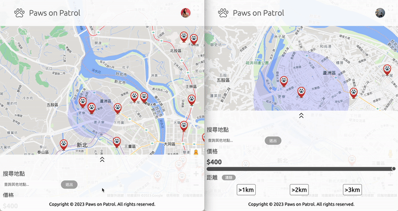
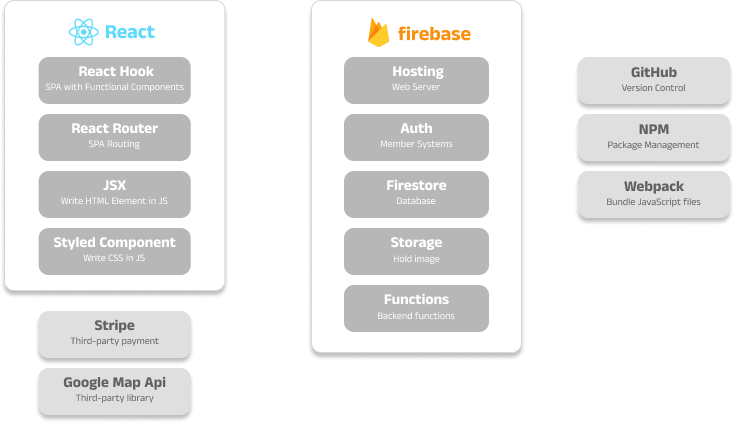

# Paws on Patrol

 

Paws on Patrol is a platform that utilizes Google Maps API to provide location-based services, helping users find nearby pet sitters. It allows for one-to-one online chat and online payment between pet sitters and pet owners.
 
 
Website URL: https://paws-on-patrol.firebaseapp.com
 
 
Test Account:
| Account | Password |
| --------------- | -------- |
| test@test.com | test123 |

Test Card:
| Card number | Expiry | CVC |
| --------------- | -------- | -------- |
| 4242 4242 4242 4242 | 12/23 | 123 |

 

 

## Table of Contents

- [Paws on Patrol](#paws-on-patrol)
  - [Table of Contents](#table-of-contents)
  - [✤ Tech Stack](#-tech-stack)
  - [✤ Main Features](#-main-features)
  - [✤ Front-end Technique](#-front-end-technique)
    - [React](#react)
      - [Component Structure:](#component-structure)
    - [React Router](#react-router)
    - [Webpack \& Babel](#webpack--babel)
  - [✤ Back-end Technique (Firebase Cloud Services)](#-back-end-technique-firebase-cloud-services)
    - [Firebase Authentication](#firebase-authentication)
    - [Cloud Firestore](#cloud-firestore)
    - [Firebase Storage](#firebase-storage)
    - [Firebase Hosting](#firebase-hosting)
    - [Firebase Functions](#firebase-functions)
  - [✤ Third Party Library](#-third-party-library)
  - [✤ Third Party Payment Gateway](#-third-party-payment-gateway)
    - [Others](#others)
  - [Contact](#contact)

## ✤ Tech Stack

 

## ✤ Main Features

1. Deploying Stripe's third-party payment function using Firebase Cloud Functions and calling it in React.
2. Managing member and invitee data through global shared props using useContext.
3. Implementing a chat room with useReducer to manage state and component behavior.
4. Integrating third-party library React Google Maps API.
5. Advanced filtering allows users to find the most suitable pet sitter by price and distance.
6. Responsive web design allows users to search for nearby users anytime, anywhere.
7. Achieving real-time updates on matching status through Firestore onSnapshot.

## ✤ Front-end Technique

### React

- SPA with functional components.
- Used hooks: `useState`, `useEffect`, `useRef`, `useContext`, `useReducer`.

#### Component Structure:

&nbsp;
組件結構

### React Router

- version: 6.6.1
- Handle the SPA routing.

### Webpack & Babel

- Handle module bundling of the project.
- ES6 JavaScript syntax for browser compatibility.

## ✤ Back-end Technique (Firebase Cloud Services)

### Firebase Authentication

- Sign in and sign up with email and password.

### Cloud Firestore

- Holds user data and chat data.

### Firebase Storage

- Host images uploaded from users.

### Firebase Hosting

- Host the static content of the project.

### Firebase Functions

- Uses Firebase Functions to deploy Stripe backend functions, which securely process payments and return responses to the frontend.

## ✤ Third Party Library

- Google Maps JavaScript API

## ✤ Third Party Payment Gateway

- Stripe

### Others

## Contact

Shu-ting, Chang
 

Email: tina8899530@gmail.com
